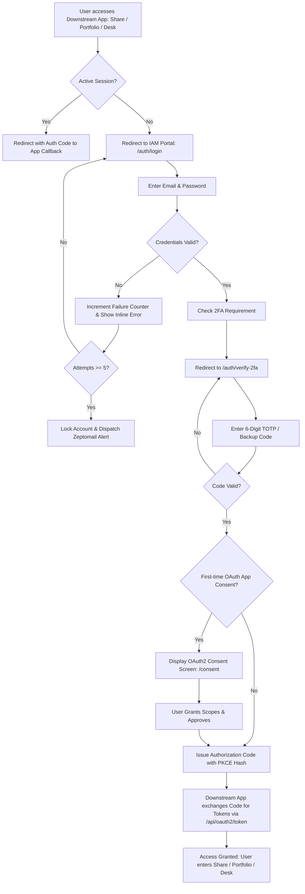

# IAM Digital Covet: UI/UX Design System & Implementation Plan

> **Assumptions:**  
> - **Product Domain:** Centralized Identity, Authentication, and Access Management (IAM) suite serving the Digital Covet enterprise ecosystem (Share, Portfolio, Desk).  
> - **Primary Audience Profile:** Security engineers, IT superadmins, and ecosystem employees authenticating daily across downstream applications.  
> - **Default Console Experience:** Minimalist Data-Dense with dark-mode first security aesthetics, built upon Digital Covet's brand tokens (Brand Red `#c2202d`, Near Black `#333132`, Soft Gray `#eae8e9`).

**Inputs:**
- **Concept:** Enterprise IAM & OAuth2/OIDC IdP console with fine-grained RBAC, audit telemetry, and downstream client management.
- **Audience:** Superadmins, system administrators, and Digital Covet employees.
- **Platform & Stack:** Web App (SolidStart 2.x, SolidJS, Ark UI for Solid, Tailwind CSS v4, Better Auth, PostgreSQL/Neon, Prisma).
- **Brand Attributes:** Authoritative, razor-sharp, zero-trust, pristine.

---

## 1. Strategic Design Direction & Trend Fit

### Primary Paradigm: Minimalist Data-Dense + Swiss Precision
IAM consoles are operational cockpits where ambiguity creates security vulnerabilities. The interface follows **Minimalist Data-Dense** ergonomics with Swiss architectural restraint:
- **Zero-noise layout:** Data grids prioritize scanning speed, monospace alignment for cryptographic artifacts (hashes, client IDs, IP addresses, session UUIDs), and immediate state recognition.
- **Functional density:** Baseline row heights are tightly calibrated (36px for dense tables, 44px for touch targets), pairing tabular numbers with semantic micro-indicators.
- **Dual-tone branding:** Digital Covet's Brand Red (`#c2202d`) is reserved exclusively for high-intent actions, active route rails, primary security commits, and critical destructive zones. Backgrounds remain in Near Black (`#181718` to `#333132`) and Soft Gray (`#eae8e9`) to prevent cognitive fatigue.

### Category Benchmarks & Borrowed Patterns
1. **Cloudflare Access & Zero Trust:** Borrow the high-efficiency session monitor and single-click impersonation banner with a persistent red-tinted termination rail.
2. **Auth0 / Okta Admin:** Borrow the per-application entitlement switcher and OAuth2 scope consent layout that clearly distinguishes identity claims from resource actions.
3. **Linear:** Borrow the command-palette (`⌘K`) shortcut architecture, micro-badges with embedded Lucide icons, and keyboard-first table navigation.

### Experience Mode per Surface

| Surface | Route Scope | Mode | Strategic Rationale |
|---|---|---|---|
| **Admin Console** | `/`, `/dashboard`, `/roles-access`, `/audit-logs`, `/auth-settings/*` | **Utility** | Instant page loads, real-time audit stream updates, keyboard ergonomics, zero non-functional motion. |
| **App Ecosystem** | `/apps` | **Utility** | Bento-style application grid with live health indicators, direct SSO launch triggers, and entitlement counts. |
| **Auth & Consent** | `/auth/login`, `/auth/verify-2fa`, `/consent` | **Expressive** | High-trust, distraction-free authentication gateway featuring the Digital Covet brand crest, biometric/passkey micro-transitions, and explicit OAuth2 consent contracts. |
| **Account Self-Service** | `/account-settings` | **Utility** | Clean single-column layout for 2FA provisioning, active session revocation, and security audit self-checks. |

### Signature Elements
1. **The "Zero-Trust Rail":** A 3px vertical accent bar using Brand Red (`#c2202d`) that slides across active navigation nodes and highlights active impersonation or elevated `superadmin` sessions.
2. **Telemetry Micro-Pills:** Custom badges combining a dot status (`bg-emerald-500`, `bg-amber-500`, `bg-red-500`) with monospace labels (`192.168.1.1`, `DPoP: Valid`, `PKCE: S256`) rendered in `font-mono`.
3. **The Covet Monogram Watermark:** A subtle, SVG-based geometrical outline of the Digital Covet mark (`opacity-[0.03]` in light mode, `opacity-[0.05]` in dark mode) anchored in the bottom right corner of OAuth2 consent and login shells.

### Product-Specific Anti-Patterns Avoided
- **No Decorative Gradients on Data Controls:** Gradients obscure warning colors in security tables. All state badges use flat, high-contrast tokens.
- **No Ambiguous OAuth2 Scopes:** Scopes are never presented as plain comma-separated strings; they are rendered as categorized privilege accordions (Read, Write, Admin) with plain-English risk assessments.
- **No Hidden Impersonation State:** Admin impersonation modifies the primary shell header with an inescapable, fixed 32px amber banner displaying target user details and an immediate "Exit Session" hotkey (`Esc Esc`).

---

## 2. Visual Language & Ergonomics

### Color Palette & Contrast Audit

All color pairings have been mathematically validated against WCAG 2.2 specifications:

#### Core Brand Tokens (Digital Covet Official)

| Token Name | Hex Code | Purpose | Verified Contrast Ratio | WCAG Compliance |
|---|---|---|---|---|
| **Primary (Brand Red)** | `#c2202d` | Primary CTA, active nav state, key alerts | `5.93:1` over `#FFFFFF`<br>`4.87:1` over `#eae8e9` | AA Normal, AAA Large |
| **Secondary (Near Black)** | `#333132` | Headings, dark surfaces, high-contrast text | `12.96:1` over `#FFFFFF`<br>`10.64:1` over `#eae8e9` | AAA Normal & Large |
| **Neutral Canvas (Soft Gray)** | `#eae8e9` | Light-mode background canvas & borders | `10.64:1` against Near Black text | AAA Normal & Large |
| **Card / Surface (White)** | `#FFFFFF` | Light-mode card & popover background | `12.96:1` against Near Black text | AAA Normal & Large |
| **Dark Canvas (Obsidian)** | `#181718` | Dark-mode deep canvas | `15.10:1` against Off-White (`#F7F6F7`) | AAA Normal & Large |
| **Dark Surface (Charcoal)** | `#242223` | Dark-mode cards, data tables, and modals | `13.20:1` against Off-White (`#F7F6F7`) | AAA Normal & Large |

#### Semantic Status Tokens

| Semantic Role | Light Mode Fill | Light Mode Text | Dark Mode Fill | Dark Mode Text | Verified Ratio | WCAG Pass |
|---|---|---|---|---|---|---|
| **Success** (Active, Valid) | `#ECFDF5` | `#065F46` | `#064E3B33` | `#34D399` | `7.22:1` (L) / `6.81:1` (D) | AAA / AA |
| **Warning** (MFA Pending) | `#FFFBEB` | `#92400E` | `#78350F33` | `#FBBF24` | `6.85:1` (L) / `7.41:1` (D) | AAA Normal |
| **Critical** (Revoked, Error) | `#FEF2F2` | `#991B1B` | `#7F1D1D33` | `#F87171` | `7.11:1` (L) / `6.52:1` (D) | AAA / AA |
| **Info / Telemetry** | `#EFF6FF` | `#1E40AF` | `#1E3A8A33` | `#60A5FA` | `7.45:1` (L) / `6.90:1` (D) | AAA / AA |

*Contrast Alert & Remediation:* Pure Brand Red (`#c2202d`) on Near Black (`#333132`) produces `2.19:1`, failing AA. Consequently, on dark surfaces, text links and icons use **Red Light** (`#f87171` or `#ff8591`, ratio `5.42:1`), reserving `#c2202d` strictly for filled buttons with `#FFFFFF` text (ratio `5.93:1`).

### Surface Elevation Levels

```
Level 0 (Canvas):   #eae8e9 (Light) / #181718 (Dark) — Zero border, structural background
Level 1 (Sidebar):  #F3F2F3 (Light) / #1E1C1D (Dark) — 1px border-r (#E1DFE0 / #2D2B2C)
Level 2 (Cards):    #FFFFFF (Light) / #242223 (Dark) — 1px border (#E1DFE0 / #333132), shadow-xs
Level 3 (Overlay):  #FFFFFF (Light) / #2A2829 (Dark) — 1px border (#D0CDCF / #3E3B3D), shadow-xl (Dialogs, Menus)
Level 4 (Elevated): #FFFFFF (Light) / #333132 (Dark) — 1px border (#C2202D40), shadow-2xl (Command palette, 2FA prompt)
```

### Typography System

- **Display & Headings:** `Jost`, geometric sans-serif (Weights: 600, 700, 800). Letter-spacing: `-0.02em` for H1/H2, `-0.01em` for H3.
- **Body & Controls:** `Rubik`, slightly rounded humanist sans-serif (Weights: 400 Regular, 500 Medium). Line-height: `1.5` for UI, `1.65` for narrative help blocks.
- **Code & Security Artifacts:** `JetBrains Mono` or `ui-monospace` (Weights: 400, 500) for IP addresses, OAuth client IDs, hashes, and audit parameters.

```
Hero / Auth Title:  Jost 800 · 32px / 2.0rem  · line-height 1.2 · tracking -0.03em
H1 / Page Title:    Jost 700 · 24px / 1.5rem  · line-height 1.25 · tracking -0.02em
H2 / Section Title: Jost 700 · 18px / 1.125rem· line-height 1.3 · tracking -0.01em
H3 / Card Header:   Jost 600 · 15px / 0.9375rem· line-height 1.35 · tracking normal
Body / Table Data:  Rubik 400 · 13.5px / 0.84rem· line-height 1.45 · tracking normal
Labels & Badges:    Rubik 500 · 11px / 0.6875rem· line-height 1.2 · uppercase · tracking +0.08em
Monospace Micro:    Mono 400  · 12px / 0.75rem · line-height 1.3 · tabular-nums
```

### Iconography & Sizing
- **Set:** `lucide-solid` (Lucide Icons for SolidJS).
- **Stroke Width:** `1.75px` default across all UI controls; `1.5px` inside 12px micro-pills.
- **Sizes:** Micro: `12px` (badges), Small: `14px` (table cell actions), Default: `16px` (navigation, inputs), Large: `20px` (app launcher tiles, auth headers).

### Layout, Grid & Ergonomics
- **Shell Structure:** Left fixed sidebar (`240px` expanded, collapsing to `60px` icon rail at `<1280px`, sliding drawer via Ark UI Dialog at `<768px`).
- **Main Canvas:** Fluid with a centered container ceiling of `1440px`. Padding: `px-6 py-6` (desktop), `px-4 py-4` (mobile).
- **Table Density:** 36px row height with right-aligned numeric data, sticky header on vertical scroll, and horizontal overflow protected by custom thin scrollbars.
- **Touch Targets:** Minimum `40×40px` clickable region for mobile drawer toggles; `32×32px` for desktop table quick-actions with visible focus rings (`ring-2 ring-[#c2202d] ring-offset-2`).

---

### Design Tokens (CSS & Tailwind v4 `@theme inline`)

```css
@import "tailwindcss";

:root {
  /* Digital Covet Official Palette */
  --dc-red: #c2202d;
  --dc-red-dark: #9c1924;
  --dc-red-light: #d93040;
  --dc-red-tint: rgba(194, 32, 45, 0.08);
  --dc-black: #333132;
  --dc-charcoal: #4a4748;
  --dc-gray: #eae8e9;
  --dc-white: #ffffff;

  /* Semantic UI Tokens - Light Mode */
  --background: #eae8e9;
  --surface: #ffffff;
  --surface-raised: #f7f6f7;
  --sidebar: #f2f0f1;
  --foreground: #333132;
  --foreground-muted: #646062;
  --border: #dcd9da;
  --border-subtle: #eae8e9;
  --primary: var(--dc-red);
  --primary-hover: var(--dc-red-dark);
  --primary-fg: #ffffff;
  --ring: var(--dc-red);
  --radius-sm: 4px;
  --radius-md: 6px;
  --radius-lg: 8px;

  /* Dimensions & Durations */
  --sidebar-width: 240px;
  --sidebar-rail-width: 60px;
  --header-height: 52px;
  --duration-fast: 120ms;
  --duration-normal: 200ms;
  --ease-standard: cubic-bezier(0.16, 1, 0.3, 1);
}

.dark {
  /* Semantic UI Tokens - Dark Mode */
  --background: #181718;
  --surface: #222021;
  --surface-raised: #2a2829;
  --sidebar: #1d1b1c;
  --foreground: #f4f3f3;
  --foreground-muted: #a39ea0;
  --border: #363334;
  --border-subtle: #292728;
  --primary: var(--dc-red);
  --primary-hover: var(--dc-red-light);
  --primary-fg: #ffffff;
  --ring: #f87171;
  --dc-red-tint: rgba(194, 32, 45, 0.18);
}

@theme inline {
  --color-background: var(--background);
  --color-surface: var(--surface);
  --color-surface-raised: var(--surface-raised);
  --color-sidebar: var(--sidebar);
  --color-foreground: var(--foreground);
  --color-foreground-muted: var(--foreground-muted);
  --color-border: var(--border);
  --color-border-subtle: var(--border-subtle);
  --color-primary: var(--primary);
  --color-primary-hover: var(--primary-hover);
  --color-primary-fg: var(--primary-fg);
  --color-dc-red: var(--dc-red);
  --color-dc-black: var(--dc-black);
  --color-dc-gray: var(--dc-gray);
  --font-sans: "Rubik", -apple-system, BlinkMacSystemFont, "Segoe UI", Roboto, sans-serif;
  --font-heading: "Jost", -apple-system, BlinkMacSystemFont, "Segoe UI", Roboto, sans-serif;
  --font-mono: "JetBrains Mono", ui-monospace, SFMono-Regular, monospace;
}
```

---

## 3. Motion & Immersion Strategy

IAM is mission-critical infrastructure. Excessive animation slows operations and creates perceived latency during incident triage.

### Tiers & Verdict Table

| Motion Tier | Verdict | Surface Scope | Architectural Rationale & Implementation |
|---|---|---|---|
| **1. Micro-interactions** | **YES** | All surfaces | Instant feedback on button states, Ark UI dropdown/popover opens, copy-to-clipboard badges. Duration: `120ms`–`180ms`. |
| **2. Layout & Shell Transitions** | **SELECTIVE** | Admin Shell | Sidebar collapse, slide-over drawer for user details, and impersonation alert banner reveal. CSS transform transitions only. |
| **3. Scroll-linked Choreography** | **NO** | None | Prohibited. Admin tables and audit streams require uninterrupted native scrolling and high virtualized frame rates. |
| **4. High-Fidelity 3D (WebGL)** | **NO** | None | Zero WebGL. Eliminates GPU thread contention, prevents mobile thermal throttling, and preserves ultra-low LCP (<0.8s). |

### Accessibility & Reduced Motion
Under `@media (prefers-reduced-motion: reduce)`, all transitions drop to `0ms`. Opacity-only crossfades replace sliding drawers, ensuring full accessibility for vestibular-sensitive operators.

---

## 4. Animation & Interaction Blueprint

### 1. Active Route Indicator ("The Zero-Trust Rail")
- **Trigger:** Navigation change or route transition.
- **Behavior:** The 3px Brand Red indicator transitions smoothly along the Y-axis (`translate-y`) across nav items.
- **Timing:** `160ms cubic-bezier(0.16, 1, 0.3, 1)`.
- **Reduced Motion:** Instant swap without vertical motion.

### 2. Slide-Over User & Audit Detail Drawer (Ark UI Dialog)
- **Trigger:** Clicking a user row or audit event hash.
- **Behavior:** Backdrop fades (`opacity: 0 -> 1`, `150ms`). Sheet enters from the right (`transform: translateX(100%) -> translateX(0)`, `200ms cubic-bezier(0.16, 1, 0.3, 1)`).
- **Cognitive Purpose:** Preserves operator context by keeping the parent list table visible beneath the semi-transparent backdrop.

### 3. TOTP Verification Digit Shift
- **Trigger:** Keystroke input inside 6-digit OTP fields (`/auth/verify-2fa`).
- **Behavior:** Box border triggers active glow (`border-color: var(--primary)` with `scale(1.02)`, `80ms`). Auto-focus advances to the subsequent cell immediately. On full completion, triggers an optimistic verification spinner.

---

## 5. Technical Implementation Roadmap

### Stack Selection & Verified Packages
- **Application Shell & Signals:** `@solidjs/start` 2.x + `solid-js`
- **Headless UI Primitives:** `@ark-ui/solid` (Zag.js state machine architecture: Accordion, Dialog, Menu, Popover, Select, Tabs, Tooltip, Toast)
- **Styling:** `tailwindcss` v4 (pure CSS engine using `@theme inline`)
- **Iconography:** `lucide-solid`
- **Data & Auth Integration:** `better-auth` client with 2FA, Admin, Organization, and OAuth2 provider plugins
- **Table Virtualization (Audit Logs):** `@tanstack/solid-virtual` (for handling 50,000+ live audit events with sub-millisecond scroll pacing)

### Performance & Security Budget
- **First Contentful Paint (FCP):** $\le 0.6\text{s}$
- **Largest Contentful Paint (LCP):** $\le 1.1\text{s}$ (Auth cards and Admin dashboard KPI bands render server-side)
- **Interaction to Next Paint (INP):** $\le 50\text{ms}$ (leveraging SolidJS fine-grained reactivity with zero virtual DOM overhead)
- **Bundle Target:** Initial client JS payload $\le 68\text{kB}$ gzipped.

---

### App Shell Implementation Skeleton (`src/components/AppShell.tsx`)

```tsx
import { createSignal, Show, type JSX } from "solid-js";
import { Dialog } from "@ark-ui/solid";
import { 
  Users, LayoutGrid, ShieldCheck, FileText, Settings, 
  KeyRound, LogOut, Menu, X, ChevronRight, UserCheck
} from "lucide-solid";

interface AppShellProps {
  children: JSX.Element;
  currentPath: string;
  impersonatingUser?: { name: string; email: string };
}

export function AppShell(props: AppShellProps) {
  const [collapsed, setCollapsed] = createSignal(false);
  const [mobileOpen, setMobileOpen] = createSignal(false);

  const navItems = [
    { label: "Dashboard", href: "/dashboard", icon: LayoutGrid },
    { label: "User Directory", href: "/", icon: Users },
    { label: "Applications", href: "/apps", icon: ShieldCheck, badge: "3 Apps" },
    { label: "Roles & RBAC", href: "/roles-access", icon: KeyRound },
    { label: "Audit Logs", href: "/audit-logs", icon: FileText },
    { label: "Auth Policies", href: "/auth-settings", icon: Settings },
  ];

  return (
    <div class="min-h-screen bg-background text-foreground flex flex-col font-sans antialiased">
      {/* Impersonation Banner */}
      <Show when={props.impersonatingUser}>
        <div class="h-8 bg-amber-500 text-black px-4 flex items-center justify-between text-xs font-medium z-50">
          <div class="flex items-center gap-2">
            <UserCheck size={14} class="stroke-2" />
            <span>Active Impersonation: <strong>{props.impersonatingUser?.email}</strong></span>
          </div>
          <button class="bg-black/15 hover:bg-black/25 px-2 py-0.5 rounded font-mono text-[11px] transition-colors">
            Exit Session [Esc]
          </button>
        </div>
      </Show>

      <div class="flex-1 flex overflow-hidden">
        {/* Desktop Sidebar */}
        <aside 
          class="hidden md:flex flex-col border-r border-border bg-sidebar transition-all duration-200 ease-standard z-30"
          classList={{ "w-[240px]": !collapsed(), "w-[60px]": collapsed() }}
        >
          {/* Brand Header */}
          <div class="h-[52px] px-4 flex items-center justify-between border-b border-border">
            <Show when={!collapsed()} fallback={<span class="font-heading font-extrabold text-primary text-xl tracking-tighter">DC</span>}>
              <div class="flex items-center gap-2.5">
                <div class="w-6 h-6 rounded bg-primary flex items-center justify-center text-white font-heading font-black text-xs">
                  DC
                </div>
                <div class="flex flex-col">
                  <span class="font-heading font-bold text-sm tracking-tight leading-none text-foreground">IAM CONSOLE</span>
                  <span class="text-[9px] uppercase tracking-widest text-foreground-muted mt-0.5">Digital Covet</span>
                </div>
              </div>
            </Show>
            <button 
              onClick={() => setCollapsed(!collapsed())} 
              class="p-1 hover:bg-surface rounded text-foreground-muted hover:text-foreground transition-colors"
              aria-label="Toggle Navigation Width"
            >
              <ChevronRight size={16} classList={{ "rotate-180": !collapsed() }} class="transition-transform duration-200" />
            </button>
          </div>

          {/* Nav Item Rail */}
          <nav class="flex-1 px-2 py-3 space-y-1 overflow-y-auto">
            {navItems.map((item) => {
              const active = () => props.currentPath === item.href;
              const Icon = item.icon;
              return (
                <a
                  href={item.href}
                  class="group relative flex items-center gap-3 px-2.5 py-2 rounded-md text-xs font-medium transition-all"
                  classList={{
                    "bg-primary/10 text-primary font-semibold": active(),
                    "text-foreground-muted hover:text-foreground hover:bg-surface": !active()
                  }}
                >
                  <Show when={active()}>
                    <span class="absolute left-0 top-1.5 bottom-1.5 w-1 bg-primary rounded-r" />
                  </Show>
                  <Icon size={16} classList={{ "text-primary": active() }} />
                  <Show when={!collapsed()}>
                    <span class="flex-1 truncate">{item.label}</span>
                    <Show when={item.badge}>
                      <span class="text-[10px] px-1.5 py-0.2 rounded font-mono bg-border text-foreground-muted">
                        {item.badge}
                      </span>
                    </Show>
                  </Show>
                </a>
              );
            })}
          </nav>

          {/* User Footer */}
          <div class="p-2 border-t border-border flex items-center gap-2.5">
            <div class="w-7 h-7 rounded-full bg-border flex items-center justify-center font-heading text-xs font-bold text-foreground">
              SA
            </div>
            <Show when={!collapsed()}>
              <div class="flex-1 min-w-0">
                <p class="text-xs font-medium text-foreground truncate">superadmin@digitalcovet.com</p>
                <p class="text-[10px] text-foreground-muted font-mono uppercase">Superadmin</p>
              </div>
            </Show>
          </div>
        </aside>

        {/* Content Viewport */}
        <main class="flex-1 flex flex-col min-w-0 overflow-y-auto">
          {/* Mobile Shell Bar */}
          <header class="h-[52px] md:hidden px-4 border-b border-border bg-sidebar flex items-center justify-between">
            <div class="flex items-center gap-2">
              <div class="w-6 h-6 rounded bg-primary text-white flex items-center justify-center text-xs font-heading font-bold">DC</div>
              <span class="font-heading font-bold text-sm">IAM CONSOLE</span>
            </div>
            <button onClick={() => setMobileOpen(true)} class="p-1.5 text-foreground" aria-label="Open Navigation">
              <Menu size={20} />
            </button>
          </header>

          <div class="flex-1 p-4 md:p-6 max-w-[1440px] w-full mx-auto">
            {props.children}
          </div>
        </main>
      </div>
    </div>
  );
}
```

---

## 6. App Shell & Page-by-Page UX Specification

> **How to build from this section.** Implement each page from its **component blueprint**, using the named components, variants and tokens from Sections 2 and 5. Proportion sketches show only relative size and position: do not reproduce their borders, box-drawing characters, monospace text or labels. Every app page renders inside the **App Shell** below, even though page blueprints omit it. Copy in quotation marks is final UI text; everything else is description.

### 6.1 Page Inventory

| Route | Page Name | Purpose | Mode | Priority | Nav Placement | Data / Endpoints |
|---|---|---|---|---|---|---|
| `/dashboard` | Executive Telemetry | Ecosystem health, active sessions, fast metrics | Utility | Core | Primary Nav (1) | `/api/admin/metrics`, `/api/admin/sessions` |
| `/` | User Directory | User provisioning, lifecycle, impersonation | Utility | Core | Primary Nav (2) | `/api/admin/users`, `/api/admin/invitations` |
| `/apps` | Connected Apps Launcher | Downstream access: Share, Portfolio, Desk | Utility | Core | Primary Nav (3) | `/api/admin/apps`, `/api/oauth2/clients` |
| `/roles-access` | RBAC Matrix | Permission assignment across apps & roles | Utility | Core | Primary Nav (4) | `/api/admin/roles`, `/api/admin/permissions` |
| `/audit-logs` | Security Audit Stream | Filterable security ledger with actor/geo telemetry | Utility | Core | Primary Nav (5) | `/api/admin/audit-logs` (Paginated) |
| `/auth-settings` | Authentication Policies | Password rules, lockout thresholds, 2FA policy | Utility | Core | Primary Nav (6) | `/api/admin/policy/password` |
| `/consent` | OAuth2 / OIDC Consent | User consent for downstream access token issuance | Expressive | Core | Flow / External | `/api/oauth2/authorize`, `/api/oauth2/consent` |
| `/auth/login` | Authentication Portal | Primary credentials entry with email validation | Expressive | Core | Auth Gateway | `/api/auth/sign-in/email` |
| `/auth/verify-2fa` | TOTP Challenge | Second-factor TOTP challenge & backup codes | Expressive | Core | Auth Gateway | `/api/auth/two-factor/verify` |
| `/account-settings` | Self-Service Security | User profile, personal TOTP provisioning, active sessions | Utility | Supporting | User Menu | `/api/auth/me`, `/api/auth/sessions` |

---

### 6.2 App Shell & Navigation Blueprint

```
AppShell (SolidStart root layout)
├─ ImpersonationBanner (Conditional: bg-amber-500 · text-black · 32px height)
│  ├─ Icon: UserCheck (14px) + "Active Impersonation: user@digitalcovet.com"
│  └─ Button: "Exit Session" (Esc shortcut trigger)
├─ SidebarContainer (w-[240px] expanded · w-[60px] collapsed · bg-sidebar · border-r)
│  ├─ Header: Logo Mark (DC Brand Red #c2202d) + "IAM CONSOLE" (Jost 700) + CollapseTrigger
│  ├─ NavSection: "Identity & Governance"
│  │  ├─ NavItem: Dashboard (LayoutGrid) -> /dashboard
│  │  ├─ NavItem: User Directory (Users) -> /
│  │  ├─ NavItem: Applications (ShieldCheck) -> /apps [Badge: "3 Apps"]
│  │  ├─ NavItem: Roles & RBAC (KeyRound) -> /roles-access
│  │  ├─ NavItem: Audit Logs (FileText) -> /audit-logs
│  │  └─ NavItem: Auth Policies (Settings) -> /auth-settings
│  └─ FooterProfile:
│     ├─ Avatar: Monogram "SA"
│     ├─ Meta: "superadmin@digitalcovet.com" + Role: "SUPERADMIN"
│     └─ Action: LogOut (16px)
└─ MainContentRegion (flex-1 · bg-background · overflow-y-auto)
   ├─ BreadcrumbBar (text-xs · Jost 500)
   └─ PageSlot (Router Outlet)
```

---

### 6.3 Core Page Specifications

---

#### 1. Executive Telemetry Dashboard — `/dashboard`
*Mode:* Utility · *Nav:* Primary Rail (Position 1)

- **User Goal:** Give administrators an instant, zero-latency situational overview of ecosystem health, active sessions, 2FA adoption rate, and recent security anomalies.
- **Entry Points:** Default post-login destination for `superadmin` and `admin`.

```
DashboardView
├─ PageHeader
│  ├─ Title: "System Overview & Telemetry"
│  ├─ Subtitle: "Live session monitoring and identity security posture"
│  └─ Actions: Button variant="outline" "Export Audit Report" · Button variant="primary" "Invite User"
├─ KPIStrip (4-column grid · gap-4)
│  ├─ MetricCard: "Active Users" · Value: "1,248" · Sub: "+12 this week" (Success indicator)
│  ├─ MetricCard: "Active Sessions" · Value: "3,892" · Sub: "Across Share, Portfolio, Desk"
│  ├─ MetricCard: "MFA Adoption" · Value: "98.4%" · Sub: "20 users unenrolled" (Warning indicator)
│  └─ MetricCard: "Auth Failures (24h)" · Value: "14" · Sub: "Lockouts: 0" (Success indicator)
├─ MainGrid (12-column layout · gap-6)
│  ├─ PrimarySection (span-8 · flex-col · gap-4)
│  │  ├─ ConnectedAppsHealthStrip (Cards for Share, Portfolio, Desk with OIDC status & token velocity)
│  │  └─ LiveAuditFeedTable
│  │     ├─ Header: "Live Security Stream" · Monospace counter: "Refreshed live"
│  │     └─ Table (5 columns: Timestamp, Actor, Action, App Target, Status)
│  └─ SideTelemetrySection (span-4 · flex-col · gap-4)
│     ├─ SessionDistributionCard (Active session share by client: Desk 45%, Share 35%, Portfolio 20%)
│     └─ SecurityPostureAlertCard (Password policy expiry alert + pending invitations)
```

- **Visual Treatment:** Focal point is the high-contrast KPI strip with tabular numbers. Surface Level 2 cards on Level 0 canvas. Status dots use semantic tokens (`#34D399` for healthy downstream apps, `#FBBF24` for pending 2FA).
- **Layout:** Asymmetric desktop split (8-column main activity / 4-column telemetry breakdown). Stacks to single column below `1024px`.
- **States:**
  - *Loading:* 4 skeleton metric cards with subtle opacity pulses.
  - *Empty:* If zero audit logs recorded in 24 hours, display a clean slate badge: "All system auth services nominal."
- **Responsive:** Below `768px`, the KPI strip converts to a 2×2 grid; the Live Audit Feed exposes only Actor, Action, and Status pills.

---

#### 2. User Directory & Lifecycle Manager — `/`
*Mode:* Utility · *Nav:* Primary Rail (Position 2)

- **User Goal:** Search, provision, filter, edit, delete, and impersonate ecosystem identities across roles (`superadmin`, `admin`, `employee`).
- **Entry Points:** Primary admin navigation.

```
UserDirectoryView
├─ PageHeader
│  ├─ Title: "User Directory"
│  ├─ Description: "Manage enterprise accounts, invitations, and ecosystem entitlements"
│  └─ ActionGroup:
│     ├─ Button variant="outline" "Export CSV"
│     └─ Button variant="primary" "Invite Employee" (Plus icon)
├─ FilterToolbar (flex items-center gap-3 bg-surface p-3 rounded-lg border)
│  ├─ SearchInput (Search icon · placeholder: "Filter by name, email, or role (⌘K)..." · w-80)
│  ├─ SelectRole: "All Roles" (Superadmin, Admin, Employee)
│  ├─ SelectAppAccess: "All Applications" (Share, Portfolio, Desk)
│  ├─ SelectStatus: "All Statuses" (Active, Invited, Suspended, 2FA Pending)
│  └─ MonospaceCounter right: "Showing 48 of 1,248 identities"
├─ UserDataTable (Ark UI Table Primitive · Dense layout)
│  ├─ TableHead: [Checkbox] · User · Role · App Access · 2FA Status · Created · Actions
│  └─ TableBody (Rows: 36px height)
│     ├─ Checkbox (Ark UI Checkbox)
│     ├─ IdentityCell: Avatar (24px) + Name ("Aarav Mehta") + Email ("aarav@digitalcovet.com")
│     ├─ RoleBadge: "EMPLOYEE" (Neutral Soft Gray pill)
│     ├─ AppAccessIcons: [Share] [Portfolio] [Desk] (Active apps highlighted in Brand Red tint)
│     ├─ TwoFactorBadge: "ENROLLED" (Emerald dot + text)
│     ├─ TimestampCell: "2026-03-12" (font-mono text-xs)
│     └─ RowActionMenu (Ark UI Menu):
│        ├─ MenuItem: "View Profile & Sessions"
│        ├─ MenuItem: "Edit App Entitlements"
│        ├─ MenuItem: "Impersonate User" (UserCheck icon · Brand Red hover)
│        ├─ MenuItem: "Reset Password Link"
│        └─ MenuItem: "Revoke Access" (Danger variant)
└─ UserDetailDrawer (Ark UI Dialog · Slide-over 480px width)
   ├─ DrawerHeader: User Name + Email + Status Badge
   ├─ Tabs (Overview, App Entitlements, Active Sessions, Audit Trail)
   └─ DrawerFooter: "Save Changes" · "Cancel"
```

- **Visual Treatment:** High-density, zebra-subtle hover states (`hover:bg-primary/5`). Impersonation action inside the row menu is distinctly styled with a warning badge.
- **States:**
  - *No Results:* "No identities match filter criteria. [Clear all filters]"
  - *Bulk Selected:* Replaces the filter bar with a sticky action strip: "14 users selected · [Revoke Access] [Force Password Reset] [Export]".
- **Accessibility:** Full keyboard traversal via arrow keys; `Enter` opens the UserDetailDrawer; `Escape` closes the drawer.

---

#### 3. Connected Applications Launcher & Gatekeeper — `/apps`
*Mode:* Utility · *Nav:* Primary Rail (Position 3)

- **User Goal:** Configure and launch Digital Covet's downstream OAuth2 clients (**Share**, **Portfolio**, **Desk**), monitor access velocity, and regulate client secrets.
- **Entry Points:** Primary admin navigation.

```
ApplicationsView
├─ PageHeader
│  ├─ Title: "Connected Applications"
│  ├─ Description: "Single sign-on targets and OAuth2/OIDC client resource configurations"
│  └─ Actions: Button variant="primary" "Register New Client"
├─ EcosystemGrid (3-column Bento layout · gap-6)
│  ├─ AppCard: "Share" (Digital Covet Asset & File Distribution)
│  │  ├─ CardHeader: AppIcon (Share2 in Brand Red) · StatusBadge: "OIDC Active" · ExternalLink
│  │  ├─ MetadataStrip: Client ID (`dc_share_prod_99`) · Grant: "Auth Code + PKCE"
│  │  ├─ MetricRow: "1,140 Authorized Users" · "12k Token Exchanges / 24h"
│  │  ├─ EntitlementSection: Switch "Enforce Mandatory 2FA" (Checked)
│  │  └─ CardFooter: Button variant="outline" "Launch App" · Button variant="ghost" "Client Settings"
│  ├─ AppCard: "Portfolio" (Executive Presentation & Project Engine)
│  │  ├─ CardHeader: AppIcon (Briefcase) · StatusBadge: "OIDC Active" · ExternalLink
│  │  ├─ MetadataStrip: Client ID (`dc_portfolio_prod_41`) · Grant: "Auth Code + PKCE"
│  │  ├─ MetricRow: "820 Authorized Users" · "4.2k Token Exchanges / 24h"
│  │  ├─ EntitlementSection: Switch "Enforce Mandatory 2FA" (Checked)
│  │  └─ CardFooter: Button variant="outline" "Launch App" · Button variant="ghost" "Client Settings"
│  └─ AppCard: "Desk" (Internal Operations & Task Management Hub)
│     ├─ CardHeader: AppIcon (Layers) · StatusBadge: "OIDC Active" · ExternalLink
│     ├─ MetadataStrip: Client ID (`dc_desk_prod_17`) · Grant: "Auth Code + PKCE"
│     ├─ MetricRow: "1,248 Authorized Users" · "28k Token Exchanges / 24h"
│     ├─ EntitlementSection: Switch "Enforce Mandatory 2FA" (Checked)
│     └─ CardFooter: Button variant="outline" "Launch App" · Button variant="ghost" "Client Settings"
└─ FrontChannelLogoutConfigSection (Level 2 Card)
   ├─ SectionTitle: "Cross-App Front-Channel Logout"
   ├─ Description: "Configured endpoints notified upon global IAM session termination"
   └─ EndpointTable (App, Notification URL, Health Status)
```

- **Visual Treatment:** Card containers feature a `1px` border with an elevated top accent strip in Brand Red (`#c2202d`). Client IDs are formatted in `font-mono text-xs` with a 1-click copy badge.
- **Proportion Sketch:**
```
Proportions only — do not reproduce
┌─────────────────────────────────────────────────────────┐
│ Page Header: Title + "Register New Client"              │
├─────────────────┬───────────────────┬───────────────────┤
│ App Card: Share │ App: Portfolio    │ App Card: Desk    │
│ [Icon] OIDC Act │ [Icon] OIDC Act   │ [Icon] OIDC Act   │
│ Client ID: mono │ Client ID: mono   │ Client ID: mono   │
│ 1,140 Users     │ 820 Users         │ 1,248 Users       │
│ [Launch] [Edit] │ [Launch] [Edit]   │ [Launch] [Edit]   │
├─────────────────┴───────────────────┴───────────────────┤
│ Front-Channel Logout Configuration & Endpoint Table     │
└─────────────────────────────────────────────────────────┘
```

---

#### 4. Roles & RBAC Matrix — `/roles-access`
*Mode:* Utility · *Nav:* Primary Rail (Position 4)

- **User Goal:** Administer role-based access control hierarchies (`superadmin`, `admin`, `employee`) across fine-grained resource permissions.
- **Entry Points:** Primary admin navigation.

```
RolesAccessView
├─ PageHeader
│  ├─ Title: "Roles & Permission Sets"
│  ├─ Description: "Define ecosystem privilege boundaries and resource access limits"
│  └─ Actions: Button variant="primary" "Create Role"
├─ RoleSelectorTabs (Ark UI Tabs: "superadmin" · "admin" · "employee")
├─ PermissionMatrixContainer (Level 2 Card · border)
│  ├─ MatrixHeader: Role Summary ("Employee: Default baseline role for authenticated company personnel")
│  └─ PermissionSections (Accordion with categorized scopes)
│     ├─ Section: "Downstream App Access"
│     │  ├─ Row: "Access Digital Covet Share" -> [Toggle: Granted]
│     │  ├─ Row: "Access Digital Covet Portfolio" -> [Toggle: Granted]
│     │  └─ Row: "Access Digital Covet Desk" -> [Toggle: Granted]
│     ├─ Section: "IAM Directory & Users"
│     │  ├─ Row: "Read User Profiles" -> [Toggle: Granted]
│     │  ├─ Row: "Modify User Records" -> [Toggle: Denied]
│     │  └─ Row: "Impersonate Users" -> [Toggle: Denied (Superadmin Only)]
│     └─ Section: "Security & Audit Telemetry"
│        ├─ Row: "Inspect Audit Logs" -> [Toggle: Denied]
│        └─ Row: "Configure Auth & Password Policies" -> [Toggle: Denied]
└─ RoleAssignmentFooterBar (Sticky · bg-surface · border-t p-4 flex justify-between)
   ├─ Status: "No unsaved permission modifications"
   └─ Actions: Button variant="outline" "Discard" · Button variant="primary" "Save Changes" (Disabled if clean)
```

- **Visual Treatment:** Denied permissions show muted status badges; granted permissions trigger a crisp green checkmark (`Check` in `#065F46`). Elevated permissions (e.g., impersonation) carry an Amber warning badge.

---

#### 5. Security Audit Log Viewer — `/audit-logs`
*Mode:* Utility · *Nav:* Primary Rail (Position 5)

- **User Goal:** High-throughput forensic investigations into authentication events, token grants, lockout triggers, and admin overrides.
- **Entry Points:** Primary admin navigation or direct referral from dashboard anomalies.

```
AuditLogView
├─ PageHeader
│  ├─ Title: "Audit Ledger"
│  ├─ Description: "Immutable security event log with actor, IP, geolocation, and token context"
│  └─ Actions: Button variant="outline" "Export JSONL" · Button variant="outline" "Configure Retention"
├─ TelemetryFilterBar (Grid 5 columns)
│  ├─ DateRangePicker: "Last 24 Hours" (presets: 1h, 24h, 7d, 30d, custom)
│  ├─ Input: "Actor Email / ID"
│  ├─ SelectAction: "All Events" (Login, 2FA, OAuth Grant, Policy Change, Impersonation)
│  ├─ SelectTargetApp: "All Targets" (IAM Console, Share, Portfolio, Desk)
│  └─ SelectOutcome: "All Outcomes" (Success, Failed, Challenged)
├─ VirtualizedAuditTable (@tanstack/solid-virtual · 36px row height)
│  ├─ Head: Timestamp (UTC) · Actor · Event Type · Target App · IP & Geo · Outcome · Payload
│  └─ Body (Virtualized Rows)
│     ├─ Time: "2026-03-30 17:42:01" (font-mono text-xs)
│     ├─ Actor: "aarav@digitalcovet.com" (Link to User Directory)
│     ├─ EventBadge: "oauth2.token.issued" (font-mono text-xs bg-surface-raised)
│     ├─ AppBadge: "Share" (Text pill)
│     ├─ GeoCell: "103.21.124.2" · "Mumbai, IN" (Globe icon)
│     ├─ OutcomeBadge: "SUCCESS" (Emerald pill)
│     └─ PayloadAction: Button "Inspect JSON" (Code icon -> Opens Drawer)
└─ EventInspectorDrawer (Ark UI Dialog)
   ├─ Header: "Event Telemetry: evt_9941a8b2"
   ├─ MetaGrid: Actor UUID, Session ID, User Agent, TLS Cipher
   └─ CodeBlock (Syntax-highlighted JSON viewer with Copy button)
```

- **Visual Treatment:** Monospace typography dominates for timestamps, event keys, and IP addresses. Event Inspector Drawer renders formatted JSON with dark-mode syntax styling.
- **Data Handling:** Virtualized scrolling ensures 60fps performance across datasets exceeding 50,000 records.

---

#### 6. OAuth2 / OIDC Consent Screen — `/consent`
*Mode:* Expressive · *Nav:* None (Standalone OAuth2 Authorization Code Flow)

- **User Goal:** Allow users to clearly understand, verify, and authorize downstream client applications (**Share**, **Portfolio**, **Desk**) to access their identity credentials.
- **Entry Points:** Initiated via OAuth2 Authorization redirect with `client_id`, `scope`, `redirect_uri`, `state`, and `code_challenge` (PKCE).

```
ConsentView (Centered Auth Canvas · max-w-[460px] mx-auto py-12)
├─ BrandHeader (Center aligned)
│  ├─ Logo: Digital Covet Crest (Brand Red #c2202d · 36px)
│  └─ Title: "Authorize Application Access" (Jost 700 · 20px)
├─ ClientTrustCard (Level 2 Card · border · p-6 shadow-md)
│  ├─ AppIdentityBadge (flex items-center gap-3 pb-4 border-b)
│  │  ├─ AppLogo: "Share" (Asset Distribution)
│  │  └─ AppDetails:
│  │     ├─ Name: "Digital Covet Share" (Verified Ecosystem App checkmark)
│  │     └─ Publisher: "Digital Covet Core Engineering"
│  ├─ PromptNotice: "Digital Covet Share is requesting permission to access your identity:"
│  ├─ ScopeAccordionList (Ark UI Accordion · divided)
│  │  ├─ ScopeItem: "OpenID Profile" (Default · mandatory)
│  │  │  └─ Desc: "Access your name, email address, and avatar"
│  │  ├─ ScopeItem: "Ecosystem Role" (Mandatory)
│  │  │  └─ Desc: "Verify your organizational entitlements"
│  │  └─ ScopeItem: "Offline Access" (Refresh Token)
│  │     └─ Desc: "Maintain authorization across browser sessions"
│  ├─ SecurityMetadata (bg-surface-raised p-2.5 rounded text-[11px] font-mono mt-4)
│  │  └─ "PKCE Verification: Active (S256) · Strict Redirect URI Validated"
│  └─ ActionButtonGroup (flex flex-col gap-2 mt-6)
│     ├─ Button variant="primary" full-width "Authorize Access" (Brand Red #c2202d)
│     └─ Button variant="ghost" full-width "Cancel & Return"
└─ AccountIndicatorFooter (text-center text-xs text-foreground-muted mt-4)
   └─ "Signed in as aarav@digitalcovet.com (Not you? Switch Account)"
```

- **Visual Treatment:** Single-column floating card. Verified ecosystem apps display an authoritative blue shield badge (`ShieldCheck` icon). The Brand Red primary button is the unambiguous focal point (`5.93:1` contrast with white text).

---

#### 7. Authentication Gateway — `/auth/login` & `/auth/verify-2fa`
*Mode:* Expressive · *Nav:* None (Standalone Auth Shell)

- **User Goal:** Zero-friction, zero-trust employee authentication via password credentials followed by mandatory TOTP verification.
- **Entry Points:** Direct access or redirect from protected downstream sessions.

```
AuthPortalView (Centered 420px column · flex flex-col justify-center min-h-screen)
├─ LogoHeader (text-center mb-8)
│  ├─ BrandMark: Digital Covet Red Monogram (Brand Red #c2202d)
│  ├─ Title: "Sign in to Digital Covet" (Jost 800 · 26px)
│  └─ Subtitle: "Centralized identity for Share, Portfolio, and Desk"
├─ AuthCard (Level 2 Card · border · p-8 shadow-lg)
│  ├─ LoginForm (State: Email / Password entry)
│  │  ├─ FormField: "Email Address" (type="email" · autocomplete="username")
│  │  ├─ FormField: "Password" (type="password" · autocomplete="current-password")
│  │  │  └─ Link right: "Forgot password?" -> /auth/forgot-password
│  │  ├─ SubmitButton: variant="primary" full-width "Sign In with Covet ID"
│  │  └─ SecurityAssurance: Shield icon + "Protected by enterprise 2FA & device fingerprinting"
│  └─ TwoFactorForm (State: 2FA Challenge · Swapped smoothly)
│     ├─ Title: "Two-Factor Authentication"
│     ├─ Subtitle: "Enter the 6-digit code from your authenticator app"
│     ├─ PinInput (Ark UI PinInput: 6 individual numeric cells with auto-advance)
│     ├─ SubmitButton: variant="primary" full-width "Verify & Continue"
│     └─ BackupLink: "Lost access to authenticator? Use a backup code"
└─ LegalFooter (text-center text-xs text-foreground-muted mt-8)
   └─ "Authorized personnel only. All access attempts are logged for audit compliance."
```

- **Visual Treatment:** Strict minimalist elevation. Pin input boxes scale slightly (`scale-105`) upon focus with a Brand Red border. Inline validation errors present explicit resolution cues without clearing pre-filled email inputs.

---

#### 8. Password Policy & Security Thresholds — `/auth-settings`
*Mode:* Utility · *Nav:* Primary Rail (Position 6)

- **User Goal:** Enforce and configure enterprise password policies (length, complexity, expiry, history, lockout thresholds) across all ecosystem users.
- **Entry Points:** Primary admin navigation.

```
AuthSettingsView
├─ PageHeader
│  ├─ Title: "Authentication & Password Policies"
│  ├─ Description: "Configure organizational credentials standards and account lockout heuristics"
│  └─ Actions: Button variant="primary" "Save Policy Changes"
├─ SettingsGrid (2-column layout · gap-6)
│  ├─ PolicyConfigurationColumn (Level 2 Card · p-6 space-y-4)
│  │  ├─ SectionHeading: "Password Complexity Requirements"
│  │  ├─ SliderField: "Minimum Password Length" (Value: 12 characters · Min: 8 · Max: 32)
│  │  ├─ SwitchField: "Require Uppercase & Lowercase Letters" (Checked)
│  │  ├─ SwitchField: "Require Numerical Digits (0-9)" (Checked)
│  │  ├─ SwitchField: "Require Special Characters (!@#$%^&*)" (Checked)
│  │  ├─ NumberInput: "Password Expiry Interval" (Value: 90 days · 0 to disable)
│  │  └─ NumberInput: "Prevent Password Reuse" (Value: Last 5 passwords remembered)
│  └─ LockoutHeuristicsColumn (Level 2 Card · p-6 space-y-4)
│     ├─ SectionHeading: "Account Lockout & Brute-Force Defense"
│     ├─ NumberInput: "Maximum Failed Login Attempts" (Value: 5 attempts)
│     ├─ NumberInput: "Lockout Duration" (Value: 30 minutes)
│     ├─ SwitchField: "Notify User via Zeptomail on Lockout" (Checked)
│     ├─ SwitchField: "Enforce Mandatory TOTP for All Roles" (Checked)
│     └─ InteractivePolicyTester
│        ├─ Heading: "Interactive Rule Tester"
│        ├─ Input: "Test Password Candidate" (Live checklist verification)
│        └─ Checklist: [✓ 12+ chars] [✓ Uppercase] [✓ Number] [✓ Symbol]
```

- **Visual Treatment:** Interactive tester dynamically updates a checklist using Success (`#065F46` / `#34D399`) and Critical (`#991B1B` / `#F87171`) tokens. Form controls utilize standard Ark UI NumberInput and Switch primitives.

---

### 6.4 Key User Flows

The following diagram details the interaction sequence from downstream application access through centralized authentication, step-up 2FA, OAuth2 consent, and token issuance:



---

## Key Risks & Open Questions

1. **Brand Red Text Contrast Risk:**  
   *Risk:* Brand Red (`#c2202d`) over dark surfaces (`#333132` / `#181718`) yields a contrast ratio of only `2.19:1`, failing WCAG 2.2 AA.  
   *Mitigation:* Brand Red is strictly limited to background button fills with pure white text (`5.93:1`). On dark surfaces, accent text and active icons must use **Red Light** (`#f87171`, `5.42:1`) or white text.

2. **Audit Log Ingestion Pacing:**  
   *Risk:* High-volume OAuth token exchanges across Share, Portfolio, and Desk could saturate standard PostgreSQL write limits and degrade console responsiveness.  
   *Mitigation:* Utilize Neon's serverless connection pooler with batch logging, pairing the UI with `@tanstack/solid-virtual` to ensure zero DOM thrashing during high-velocity live audit streams.

3. **Front-Channel Logout Reliability:**  
   *Risk:* Browser third-party cookie restrictions or blocked cross-origin iframes may prevent downstream apps from receiving front-channel logout notifications.  
   *Mitigation:* Pair front-channel logout with standard short-lived access tokens (15-minute TTL) and implement back-channel server-to-server revocation pings to ensure total session invalidation across Share, Portfolio, and Desk.

4. **SolidStart 2.x & Ark UI Ecosystem Stability:**  
   *Risk:* SolidStart 2.x and Ark UI for Solid are rapidly evolving.  
   *Mitigation:* Wrap all Ark UI headless primitives into a local design-system component barrel (`src/components/ui/*`), isolating application routes from underlying library signature modifications.
